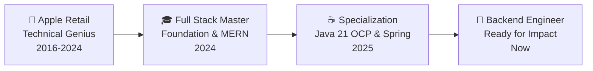

# Hello! 👋 I'm Sara Buitrago

<div align="center">
  
</div>

## 🚀 About Me

🎯 **Junior Java Backend Developer** specialized in **Spring Boot & Cloud Architectures** 🌱 **Oracle Certified Professional: Java SE 21** 🏆 (The gold standard in Java)  
💡 **Problem Solver:** 8 years at **Apple Retail** solving complex technical issues, now building scalable code  
⚡ **Clean Code Advocate:** Focused on design patterns, SOLID principles, and robust APIs  
🔧 **Full Stack Capability:** Building modern UIs with **Angular (v16+)** and reactive programming  
⚡ **Fun fact:** I used to debug hardware bugs at the Genius Bar; now I hunt software bugs in the backend! 🐛➡️💻

## 🛠️ Tech Stack

### ☕ Backend & Cloud


### ⚛️ Frontend


### 🗄️ Databases & Infrastructure


### 🧪 Testing & Tools


## 📊 GitHub Stats

<div align="center">
  
  
</div>

## 🏆 Certifications & Education

<div align="center">

| 🏅 **Oracle Certified Professional** | 🎓 **Cloud & Backend Specialist** | 💻 **Full Stack Master** |
|:---:|:---:|:---:|
| **Java SE 21 Developer** | Java SE Cloud & Spring Boot | MERN & Angular |
| Issued 2025 | CRN Getafe (2025) | Escuela CEI (2024) |

</div>

## 💼 My Journey



### 🍎 **The Apple Legacy:**

* **Troubleshooting:** Expert in identifying root causes in complex systems.
* **Agile Mindset:** Used to fast-paced environments and high-quality standards.
* **Communication:** Bridge between technical complexity and user-friendly solutions.

### 💻 **Current Focus:**

* **Microservices:** Implementing Service Discovery (Eureka), API Gateways, and Feign Clients.
* **Modern Java:** Leveraging Java 21 features (Records, Pattern Matching, Virtual Threads).
* **Reactive UIs:** Building efficient state management with Angular Signals.

## 🌐 Connect with Me

<div align="center">
<a href="https://linkedin.com/in/sarabtrg/" target="_blank">

</a>
</div>

---

<div align="center">


**"From hardware diagnostics to clean code architecture...! 🧬✨"**

</div>

<div align="center">

</div>

```

