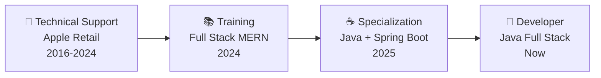

# Hello! 👋 I'm Sara Buitrago

  

## 🚀 About Me

🎯 **Java Backend Developer** specialized in **Spring Boot** and **Microservices**  
💡 Successful transition from **8+ years in technical support** to backend development  
🌱 **Oracle Certified Professional: Java SE 21** 🏆  
⚡ **API Development** + **Backend Architecture** expertise  
🔧 Real experience solving complex technical problems  
🤝 Effective communication with both technical and non-technical profiles  
⚡ **Fun fact:** From fixing iPhones to building robust APIs! 📱➡️💻

## 🛠️ Tech Stack

### ☕ Backend

### ⚛️ Frontend

### 🗄️ Databases

### 🛠️ Tools & DevOps

### 🧪 Testing & APIs

## 📊 GitHub Stats

  
  

  

## 🏆 Certifications

| 🏅 **Oracle Certified Professional** | 🎓 **Full Stack Master's** | ☕ **Java SE Cloud** |
|:---:|:---:|:---:|
| Java SE 21 | MERN Stack - CEI School | CRN Getafe |
| **2025** | **2024** | **2025** |

## 💼 My Journey

```mermaid
graph LR
    A[🔧 Technical Support<br/>Apple Retail<br/>2016-2024] --> B[📚 Training<br/>Full Stack MERN<br/>2024]
    B --> C[☕ Specialization<br/>Java + Spring Boot<br/>2025]
    C --> D[🚀 Developer<br/>Java Full Stack<br/>Now]
```

### 🍎 **My Apple Retail experience taught me:**
- Solving complex problems under pressure
- Communicating technical solutions clearly
- Managing multiple tools simultaneously
- Working autonomously and investigating errors
- Attention to detail in diagnostics

### 💻 **My transition to development:**
- **MERN Stack** → Solid foundations in web development
- **Java + Spring Boot** → Robust and scalable backend
- **Microservices** → Modern architectures
- **Docker + Kubernetes** → DevOps and deployment

## 🌐 Connect with Me

  
  

## 🎯 Currently...

- 🔍 **Looking for:** First opportunity as a Java Backend Developer
- 📚 **Learning:** Advanced design patterns and cloud architectures
- 💪 **Strengths:** Problem-solving + API Design + System Architecture
- 🚀 **Goal:** Join a backend team where I can build scalable systems

## 🌍 Languages

**English:** B2-C1  
**Spanish:** Native

---

  
  
  **"From diagnosing hardware bugs to creating bug-free code... debugging has always been my strength! 🐛✨"**

  

